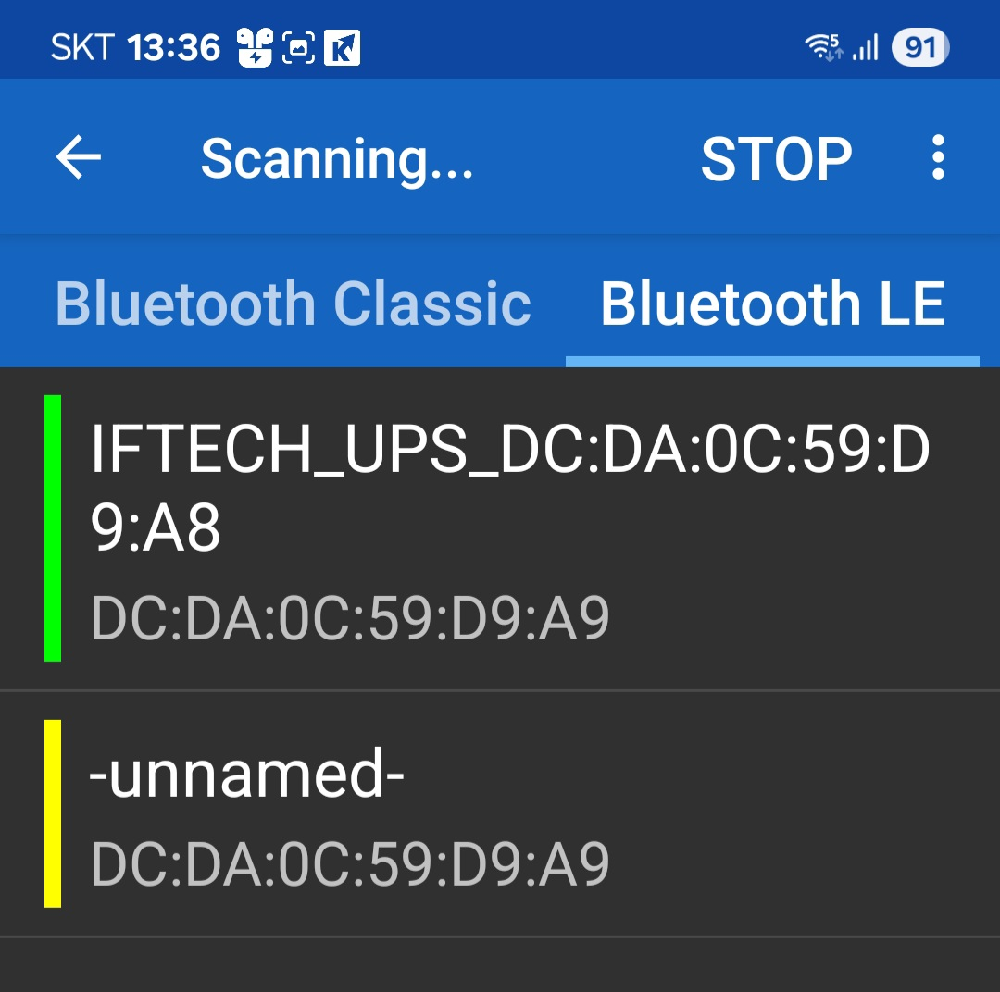
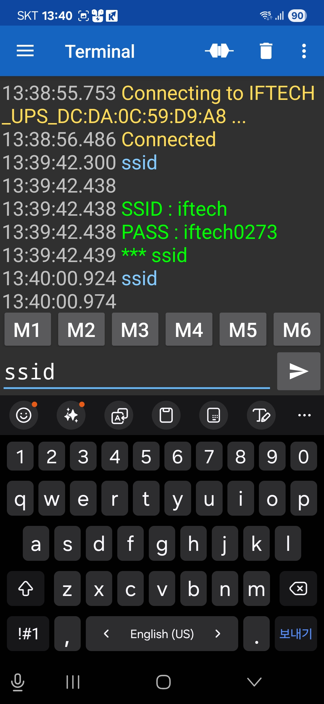

# 펌웨어 업그레이드 방법
1. firmware 업그레이드는 블루투스와 와이파이를 사용하여 진행 합니다.
2. 핸드폰의 play store열 열고 "serial bluetooth"를 검색합니다. 

3. 설치가 완료 되면 프로그램을 열고 좌측상단의 메뉴를 선택 한 후 "device"를 선택합니다. 
4. Bluetooth LE를 선택한후 SCAN 를 실행합니다. 
5. 그림에 보이는 것과 같이 IFTECH_UPS_xx:xx:xx:xx:xx 보이면 장비 검색이 된것입니다. 

6. 선택을 하면 연결된 화면이 보입니다.   
   입력창에 ssid라고 입력을 하면 현재 시스템이 접속하고자 하는 wifi의 
   ssid 및 password를 보여 줍니다. 

7. 핸드폰의 모바일 핫스팟 기능을 켜주고, ssid와 passwd를 맞추어 줍니다. 
   핫스팟의 보안은 WPA2로 설정하면 됩니다.
8. 기존의 와이파이 공유기를 사용할경우에는 입력창에   
   ssid newssid   
   를 입력하여 전송하여 주시고
9. pass newpass   
   를 입력하여 줍니다. 
10. 이제 update 명령을 입력하고 전송합니다. 
11. 시스템을 다시 시작한다는 메시지가 나오며 4.3" 화면이 리셋되며 업그레이드를 진행 합니다. 

  
   

